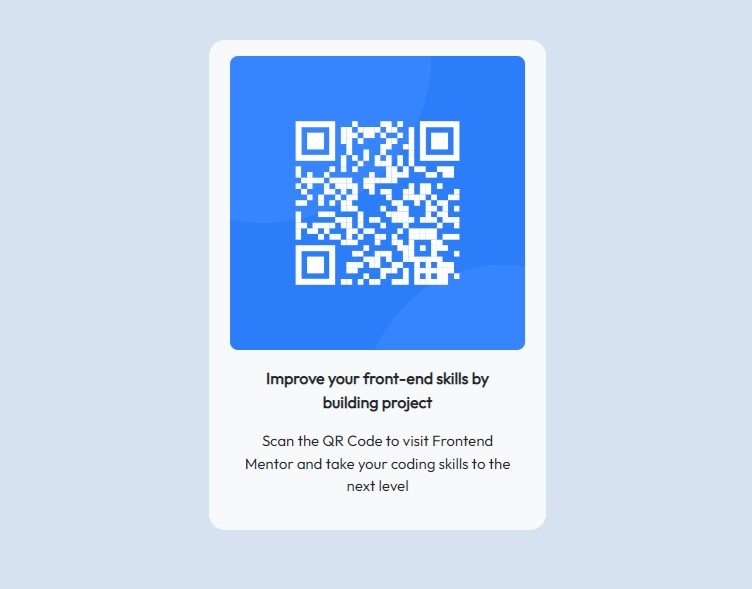

# Frontend Mentor - QR code component solution

This is a solution to the [QR code component challenge on Frontend Mentor](https://www.frontendmentor.io/challenges/qr-code-component-iux_sIO_H). Frontend Mentor challenges help you improve your coding skills by building realistic projects. 

## Table of contents

- [Overview](#overview)
  - [Screenshot](#screenshot)
  - [Links](#links)
- [My process](#my-process)
  - [Built with](#built-with)
  - [What I learned](#what-i-learned)
  - [Continued development](#continued-development)
  - [Useful resources](#useful-resources)
- [Author](#author)
- [Acknowledgments](#acknowledgments)

## Overview

### Screenshot

## My process
HTML Structuring
CSS styling
Responsiveness
Review
### Built with

- Semantic HTML5 markup
- CSS custom properties
- Mobile-first workflow
- [Bootstrap](https://getbootstrap.com/) - JS,HTML and CSS library

### What I learned

I use the challenge to revise what I have since many months ago

### Continued development

I want know more about responsiveness and bootstrap uses

## Author

- Website - [Adewale Toheeb](https://linkedin/in/ToheebDev)
- Frontend Mentor - [@Toheeb-dev](https://www.frontendmentor.io/profile/Toheeb-dev)
- Twitter - [@ToheebDev](https://twitter.com/ToheebDev)

## Acknowledgments

A website can be build within an hour if your have sstructure all your processes correctly

